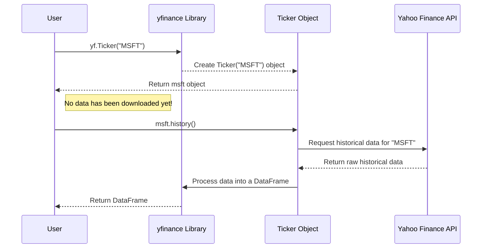

# Chapter 1: The Ticker Object

Welcome to your journey with `yfinance`! If you've ever wanted to get financial data—like stock prices for your favorite companies—you're in the right place. In this first chapter, we'll meet the most fundamental building block of the `yfinance` library: the `Ticker` object.

### The Goal: Getting Data for One Company

Imagine you want to start analyzing Microsoft. You might ask questions like:
*   What was its stock price last month?
*   What's the company's address?
*   What do its financial statements look like?

The `Ticker` object is your tool to answer all these questions. Think of it as a dedicated digital folder for a single financial instrument, like a stock. For Microsoft, its stock symbol (or "ticker") is `MSFT`. Let's create a `Ticker` object for it.

### Creating Your First Ticker Object

Getting started is as simple as importing the library and creating an object. All you need is the company's ticker symbol.

```python
import yfinance as yf

# Create a Ticker object for Microsoft
msft = yf.Ticker("MSFT")
```

That's it! You've just created `msft`, a gateway to all sorts of data about Microsoft.

An important thing to understand is that **this line of code doesn't download any data yet**. It just prepares the gateway. This is called "lazy loading," and it's very efficient because we only fetch the data we explicitly ask for.

### Asking for Specific Information

Now that we have our `msft` object, we can start asking it for information.

#### 1. Getting Historical Prices

Let's ask for the stock price history for the last month. We use the `.history()` method for this.

```python
# Get historical market data for the last month
hist = msft.history(period="1mo")

print(hist.head()) # Print the first 5 rows
```

**What you'll see:**

This command fetches the daily Open, High, Low, and Close prices, along with the trading Volume for the past month. The result is a `pandas` DataFrame, which is like a powerful spreadsheet perfect for data analysis.

```
                  Open        High         Low       Close      Volume  Dividends  Stock Splits
Date
2023-10-02  315.040002  319.649994  314.880005  318.920013    20803300        0.0           0.0
2023-10-03  317.380005  318.510010  313.540009  315.609985    19927800        0.0           0.0
2023-10-04  316.079987  321.739990  315.829987  321.549988    21340100        0.0           0.0
2023-10-05  321.059998  322.010010  318.010010  321.649994    19022600        0.0           0.0
2023-10-06  319.339996  330.019989  319.019989  329.890015    25400600        0.0           0.0
```

#### 2. Getting General Company Info

What if you want basic information, like the company's industry or a summary of its business? The `.info` property gives you this.

```python
# Get general company information
info = msft.info

print(info['longName'])
print(info['sector'])
print(info['website'])
```
**What you'll see:**

This returns a Python dictionary filled with details. We've just printed the company's full name, its sector, and its website.

```
Microsoft Corporation
Technology
https://www.microsoft.com
```

#### 3. Getting Financial Statements

You can also pull official financial reports like the balance sheet.

```python
# Get the company's balance sheet
balance_sheet = msft.balance_sheet

print(balance_sheet)
```

**What you'll see:**

This returns another DataFrame containing Microsoft's assets, liabilities, and equity over the last few years. It's a goldmine for fundamental analysis!

### What's Happening Under the Hood?

You might be wondering how `yfinance` does this. The process is quite simple and illustrates the power of lazy loading.

1.  **Creation:** When you run `msft = yf.Ticker("MSFT")`, you create an object that *knows* it's responsible for the "MSFT" ticker, but it doesn't do anything else.
2.  **Request:** When you call a method like `msft.history()`, the `Ticker` object springs into action.
3.  **Fetch:** It sends a request over the internet to Yahoo Finance's servers, asking specifically for the historical data for "MSFT".
4.  **Return:** Yahoo Finance sends the data back, and `yfinance` neatly packages it into a DataFrame for you.

This flow ensures that you only use your internet connection and processing power when you absolutely need to.

Here is a diagram illustrating the process when you ask for historical data:



If you look inside the `yfinance` source code, specifically in the file `yfinance/base.py`, you'll see the `__init__` method of the `TickerBase` class. It's quite simple!

```python
# From yfinance/base.py

class TickerBase:
    def __init__(self, ticker, session=None, proxy=_SENTINEL_):
        # ... some setup code ...
        self.ticker = ticker.upper()
        # ... more setup, but no heavy data fetching! ...
```

This confirms that creating a `Ticker` is a lightweight operation. The real work happens inside methods like `history()`, which internally call functions to fetch data on demand. This "just-in-time" data fetching is what makes the `Ticker` object so fast and efficient to use.

### Conclusion

You've just learned about the most important object in `yfinance`: the `Ticker`.

*   **What it is:** A gateway to all data for a single financial symbol (e.g., "MSFT").
*   **How it works:** It uses a "lazy-loading" approach, meaning it only fetches data when you ask for it.
*   **How to use it:** You create it with `yf.Ticker("SYMBOL")` and then access data through its methods (`.history()`) and properties (`.info`, `.balance_sheet`).

The `Ticker` object is your go-to tool for deep-diving into a single company. But what if you want to compare Microsoft to Apple and Google all at once? For that, we need a way to handle multiple tickers efficiently.

That's exactly what we'll cover in the next chapter on [Multi-Ticker Operations](02_multi_ticker_operations_.md).

---

Generated by Codebase Knowledge Builder