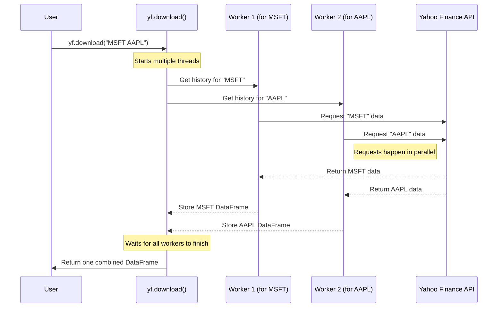

# Chapter 2: Multi-Ticker Operations

In [Chapter 1: The Ticker Object](01_ticker_object_.md), we learned how to get detailed information for a single company using the `Ticker` object. This is perfect for a deep dive into one stock. But what if you want to compare the performance of several major tech companies, like Microsoft, Apple, and Google? Fetching them one by one would be slow and repetitive.

This is where multi-ticker operations come in. `yfinance` provides powerful tools designed to fetch data for many stocks at once, saving you time and code.

### The Goal: Comparing Multiple Companies

Let's set a simple goal: **Get the last month's stock price history for Microsoft (`MSFT`), Apple (`AAPL`), and Google (`GOOG`) all in one go.**

Doing this one by one would look like this:

```python
# The slow, one-by-one way (don't do this!)
msft_hist = yf.Ticker("MSFT").history(period="1mo")
aapl_hist = yf.Ticker("AAPL").history(period="1mo")
goog_hist = yf.Ticker("GOOG").history(period="1mo")
# Now we have three separate tables to manage...
```

This works, but it's inefficient. If you have 100 stocks, you'd be making 100 separate requests one after another. `yfinance` gives us two much better ways: the `download()` function and the `Tickers` class.

### 1. The Quickest Way: `yf.download()`

Think of `yf.download()` as a highly efficient assistant. You give it a list of items, and it goes and fetches all of them simultaneously, returning everything to you in a single, neatly organized table. It's the fastest way to get historical price data for multiple stocks.

Let's use it to achieve our goal. All you need to do is provide the ticker symbols in a single string, separated by spaces.

```python
import yfinance as yf

# Download historical data for multiple tickers at once
data = yf.download("MSFT AAPL GOOG", period="1mo")

print(data.head())
```

**What you'll see:**

Instead of three separate tables, you get one master `pandas` DataFrame. The columns are neatly organized by stock price metrics (like `Close`, `Open`) and then by ticker symbol.

```
                  Adj Close                           Close  ...        Volume
                       AAPL        GOOG        MSFT    AAPL  ...        GOOG      MSFT
Date                                                       ...
2023-10-02       173.750000  132.539993  315.750000   173.75  ...    51351100  20803300
2023-10-03       172.399994  132.050003  314.730011   172.40  ...    50073500  19927800
2023-10-04       173.660004  134.940002  318.899994   173.66  ...    52036500  21340100
2023-10-05       174.910004  134.800003  319.290009   174.91  ...    44362100  19022600
2023-10-06       177.490005  137.960007  327.260010   177.49  ...    56758400  25400600
```

Notice the columns have two levels. For example, to get just the closing prices for all stocks, you can easily select the `Close` column.

```python
# Get just the closing prices
close_prices = data['Close']

print(close_prices.head())
```

**What you'll see:**

```
                  AAPL        GOOG        MSFT
Date
2023-10-02  173.750000  132.539993  315.750000
2023-10-03  172.399994  132.050003  314.730011
2023-10-04  173.660004  134.940002  318.899994
2023-10-05  174.910004  134.800003  319.290009
2023-10-06  177.490005  137.960007  327.260010
```

This is incredibly powerful for comparing stocks or calculating portfolio returns. `yf.download()` is your go-to function for bulk historical data.

### 2. The Organizer: `yf.Tickers`

What if you want more than just historical prices? Maybe you want the `.info` for Apple, the `.balance_sheet` for Google, and the `.history()` for Microsoft.

The `Tickers` class (notice the "s" at the end) is designed for this. It acts as a container or a folder that holds multiple `Ticker` objects, allowing you to manage them as a group.

```python
import yfinance as yf

# Create a Tickers object
tickers = yf.Tickers('msft aapl goog')
```

This line creates an object that holds three individual `Ticker` objects. Now you can easily access each one.

```python
# Access the Ticker object for Apple
aapl_ticker = tickers.tickers['AAPL']

# Now you can use it just like we did in Chapter 1
print(aapl_ticker.info['longName'])
```
**What you'll see:**
```
Apple Inc.
```

The `Tickers` object also has its own `.history()` method, which conveniently calls `yf.download()` for you.

```python
# Get history for all tickers in the group
hist = tickers.history(period="1mo")

# The output is grouped by ticker first
print(hist.head())
```
**What you'll see:**

The output is similar to `yf.download()`, but the columns are grouped by ticker first by default.

```
          AAPL                                         ...         MSFT
          Open        High         Low       Close     ...         High         Low       Close   Volume
Date                                                   ...
2023-10-02  171.220001  174.300003  170.929993  173.750000     ...   319.649994  314.880005  318.920013  20803300
...
```

**When should you use `download` vs. `Tickers`?**

*   **Use `yf.download()`** when you only need **historical price data** for many stocks. It's direct and fast.
*   **Use `yf.Tickers`** when you need to manage a group of stocks and want to access **different types of data** for each one (e.g., `.info`, `.financials`, etc.).

### What's Happening Under the Hood? The Magic of Threading

How does `yf.download("MSFT AAPL GOOG")` get data so much faster than calling `yf.Ticker()` three times in a row? The secret is **multithreading**.

Imagine you have to get three books from a library. The one-by-one approach is:
1.  Go to the "M" section, find the Microsoft book, and bring it back.
2.  Go to the "A" section, find the Apple book, and bring it back.
3.  Go to the "G" section, find the Google book, and bring it back.

You spend a lot of time walking back and forth.

The `yf.download()` approach is like hiring three assistants (threads):
1.  You tell Assistant 1 to get the Microsoft book.
2.  At the same time, you tell Assistant 2 to get the Apple book.
3.  And at the same time, you tell Assistant 3 to get the Google book.

They all work in parallel, and the total time it takes is only as long as the slowest assistant. This is much more efficient!

Here is a diagram showing how `yf.download` works:


If you peek inside the `yfinance` source code, specifically in `yfinance/multi.py`, you'll find the `download` function. It loops through your list of tickers and kicks off a threaded task for each one.

```python
# Simplified from yfinance/multi.py

# A loop inside the download() function
for i, ticker in enumerate(tickers):
    _download_one_threaded(ticker, ...)
```

The `_download_one_threaded` function is where the magic happens. It runs in its own thread and, at its core, it simply creates a [Ticker Object](01_ticker_object_.md) and calls its `.history()` method.

```python
# Simplified from yfinance/multi.py

def _download_one(ticker, ...):
    # It creates a Ticker object just like we did in Chapter 1!
    data = Ticker(ticker).history(...)
    # It then saves the result to a shared place
    shared._DFS[ticker.upper()] = data
```

Each thread fetches data for its assigned ticker and stores the result in a shared dictionary (`shared._DFS`). Once all the threads have finished, the `download` function combines all the individual DataFrames into the single, master DataFrame that it returns to you.

This clever use of threading makes `yfinance` incredibly fast for gathering large datasets.

### Conclusion

You've now unlocked the ability to work with multiple stocks at once, a crucial skill for any real-world financial analysis.

*   **What you learned:** How to fetch data for multiple tickers efficiently.
*   **Key Tools:**
    *   `yf.download()`: Your high-speed tool for bulk-downloading **historical price data**.
    *   `yf.Tickers`: Your organizer for managing a group of `Ticker` objects to get **varied types of data**.
*   **The Big Idea:** `yfinance` uses multithreading to run multiple data requests in parallel, which is significantly faster than doing them one by one.

So far, we've assumed you already know which tickers you want to analyze. But what if you want to discover new ones? For instance, how would you find all technology stocks based in the USA with a high dividend yield? For that, you'll need a way to screen and search for stocks.

That's precisely what we'll explore in the next chapter on [Screener & Query Objects](03_screener___query_objects_.md).

---

Generated by Codebase Knowledge Builder