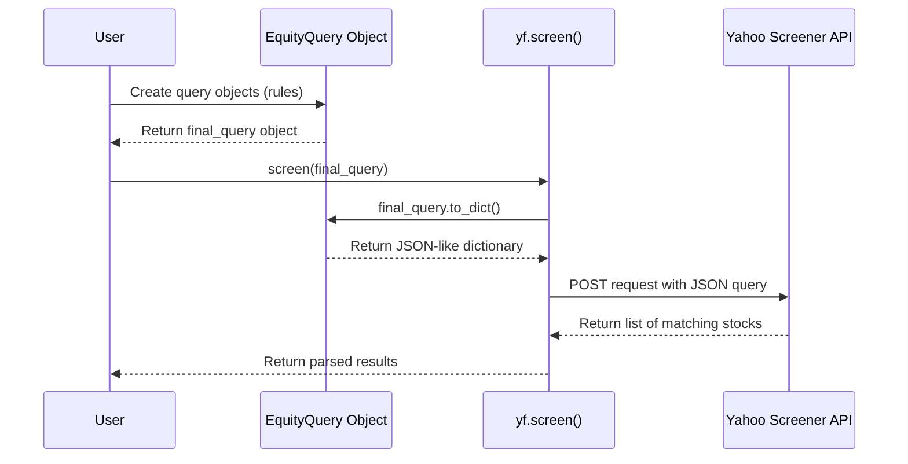

# Chapter 3: Screener & Query Objects

In the previous chapters on the [Ticker Object](01_ticker_object_.md) and [Multi-Ticker Operations](02_multi_ticker_operations_.md), we focused on getting data for stocks we already knew by name, like "MSFT" or "AAPL". But what if you don't know which stocks you're interested in yet? What if you want to *discover* new investment opportunities?

This is where the screener comes in. It's like a powerful search engine for the entire stock market, allowing you to find companies that match your specific criteria.

### The Goal: Discovering New Stocks

Imagine you're an investor interested in finding stable, US-based technology companies. You might have a specific question like:

**"Show me all technology stocks in the United States with a market capitalization between $10 billion and $100 billion."**

This isn't something you can answer by looking up a single ticker. You need a tool to scan the market for you. Let's see how `yfinance` helps us do just that.

### 1. The Easy Way: Predefined Screeners

Yahoo Finance already has several common searches saved for you, like "Day Gainers" or "Growth Technology Stocks". `yfinance` gives you direct access to these.

Let's try running the "growth_technology_stocks" screener. All we need is the `screen()` function.

```python
import yfinance as yf

# Run a predefined screener for growth technology stocks
results = yf.screen('growth_technology_stocks')

# The result is a dictionary, let's look at the first 5 stocks found
print(results['quotes'][:5])
```

**What you'll see:**

You'll get back a list of stocks that match Yahoo's definition of a "growth technology stock," neatly packaged with their ticker symbols and names.

```
[{'symbol': 'PANW', 'longName': 'Palo Alto Networks, Inc.'}, {'symbol': 'AMD', 'longName': 'Advanced Micro Devices, Inc.'}, {'symbol': 'ADBE', 'longName': 'Adobe Inc.'}, {'symbol': 'ACN', 'longName': 'Accenture plc'}, {'symbol': 'UBER', 'longName': 'Uber Technologies, Inc.'}]
```

This is great for common searches, but it doesn't answer our specific question about market cap. For that, we need to build our own custom query.

### 2. The Powerful Way: Building Your Own Query

To build a custom search, we need to give `yfinance` a set of precise instructions. We do this using `EquityQuery` objects. Think of an `EquityQuery` as a single rule or filter in our search.

Let's build our query piece by piece to answer our goal.

#### Step 1: Create a rule for the region

First, we want stocks in the United States. The rule for this looks like `['region', 'eq', 'us']`, which means "region equals 'us'". We wrap this in an `EquityQuery` object.

```python
from yfinance import EquityQuery

# Rule 1: The company's region must be the United States.
rule1 = EquityQuery('eq', ['region', 'us'])
```

#### Step 2: Create a rule for the sector

Next, we only want technology companies. The rule is `['sector', 'eq', 'Technology']`.

```python
# Rule 2: The company's sector must be 'Technology'.
rule2 = EquityQuery('eq', ['sector', 'Technology'])
```

#### Step 3: Create a rule for the market cap

Finally, we want a market cap between $10 billion and $100 billion. The operator for "between" is `btwn`.

```python
# Rule 3: Market cap must be between $10B and $100B.
# Note: We use the full numbers, not abbreviations like "$10B".
rule3 = EquityQuery('btwn', ['intradaymarketcap', 10000000000, 100000000000])
```

#### Step 4: Combine the rules

Now we have three separate rules. We need to tell the screener to find stocks that match **all three** of them. We do this by creating one final `EquityQuery` that combines them with an `and` operator.

```python
# Combine all rules with 'and'
final_query = EquityQuery('and', [rule1, rule2, rule3])

print(final_query)
```

This `final_query` object now represents our complete set of instructions. Printing it shows the nested structure of our search.

#### Step 5: Run the custom screen

We're ready! We pass our custom `final_query` object to the `screen()` function.

```python
# Run the screen with our custom query
results = yf.screen(final_query)

# Let's see the first 5 stocks it found
print(results['quotes'][:5])
```

**What you'll see:**

Success! The output is a list of technology stocks in the US that fit our specific market cap criteria.

```
[{'symbol': 'ADSK', 'longName': 'Autodesk, Inc.'}, {'symbol': 'TEAM', 'longName': 'Atlassian Corporation'}, {'symbol': 'FTNT', 'longName': 'Fortinet, Inc.'}, {'symbol': 'ANET', 'longName': 'Arista Networks, Inc.'}, {'symbol': 'PAYX', 'longName': 'Paychex, Inc.'}]
```

You've just become a data detective, programming your own search to find hidden gems in the market! There are also `FundQuery` objects for searching mutual funds and many more operators (`lt` for less than, `gt` for greater than) to explore.

### What's Happening Under the Hood?

Building a query might seem like magic, but it's a very logical process. You are essentially building a structured request that `yfinance` translates for Yahoo's servers.

1.  **Build:** When you create an `EquityQuery` like `EquityQuery('eq', ['region', 'us'])`, you are creating a Python object that holds your rule (`eq`, `region`, `us`) in a structured way.
2.  **Translate:** When you pass this object to `yf.screen()`, it calls a special method on your query object called `.to_dict()`. This method converts your Python object into a JSON format that the Yahoo Finance API can understand.
3.  **Request:** `yfinance` sends this JSON "instruction sheet" to the Yahoo Finance screener API.
4.  **Return:** The API runs the search on its massive database and sends back a list of matching stocks, which `yfinance` then gives to you.

Here's a diagram of the process:



If we look inside the `yfinance` source code, we can see this exact process. The `EquityQuery` class in `yfinance/screener/query.py` is responsible for holding your rules.

```python
# Simplified from yfinance/screener/query.py

class QueryBase:
    def __init__(self, operator, operand):
        # ... validation code ...
        self.operator = operator
        self.operands = operand

    # This is the key translation step!
    def to_dict(self) -> Dict:
        return {
            "operator": self.operator,
            "operands": [o.to_dict() if isinstance(o, QueryBase) else o for o in self.operands]
        }
```

Then, the `screen` function in `yfinance/screener/screener.py` takes your query object, calls `.to_dict()`, and sends it off.

```python
# Simplified from yfinance/screener/screener.py

def screen(query, ...):
    # ... setup code ...

    if isinstance(query, QueryBase):
        post_query = {}
        # Here's where it translates your object!
        post_query['query'] = query.to_dict()

        # It then sends this 'post_query' to Yahoo's API
        response = _data.post(_SCREENER_URL_, body=post_query, ...)
        return response.json()['finance']['result'][0]
```

By separating the **building** of the query (`EquityQuery`) from the **execution** of the search (`screen`), `yfinance` gives you a powerful and flexible way to find exactly what you're looking for.

### Conclusion

You've now moved from simply fetching data to actively discovering it.

*   **What you learned:** How to find stocks and funds that match specific criteria using the screener functionality.
*   **Key Tools:**
    *   `yf.screen('predefined_name')`: For running common, pre-built searches quickly.
    *   `EquityQuery` & `FundQuery`: For building your own custom, complex search rules.
    *   `yf.screen(your_query_object)`: For executing your custom search.
*   **The Big Idea:** You can programmatically define a set of rules and send them to Yahoo Finance to get a list of securities that match, acting as a powerful discovery tool.

So far, all the data we've worked with has been historical or delayed. But what if you want to see stock prices change in real-time, as they do on a trading floor? For that, we need a continuous connection to the data source.

In the next chapter, we will explore just that with the [WebSocket (Live Data Streaming)](04_websocket__live_data_streaming__.md).

---

Generated by Codebase Knowledge Builder