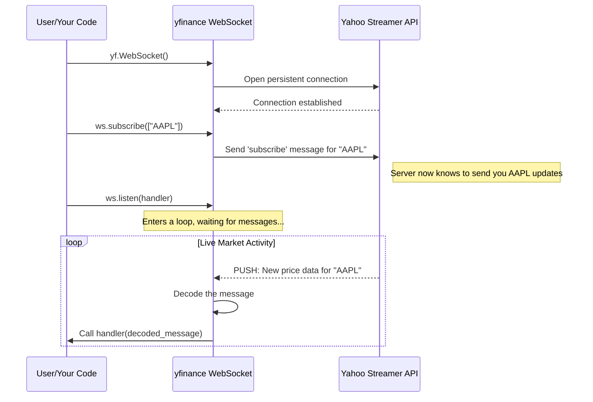

# Chapter 4: WebSocket (Live Data Streaming)

In the previous chapters on the [Ticker Object](01_ticker_object_.md) and [Screener & Query Objects](03_screener___query_objects_.md), we've been *asking* for data. We say, "Give me the history for Apple," and `yfinance` goes and fetches it. This is like looking up a historical record in an archive. But what if you want to see the price of Apple stock change *right now*, as trades are happening?

For that, you need a live feed, not an archive. This is where `yfinance`'s WebSocket comes in. It opens a continuous, live connection to Yahoo Finance, so you get price updates the moment they happen.

### The Goal: Watching a Stock Price Live

Let's set a simple goal: **Watch the price of Apple (`AAPL`) and Bitcoin (`BTC-USD`) change in real-time.** We want our program to print out new price information as soon as it's available, just like a live ticker on a news channel.

### The Old Way vs. The Live Way

With the tools we've used so far, you might try to solve this by repeatedly asking for the price every second.

```python
# The inefficient way (don't do this!)
import time
import yfinance as yf

aapl = yf.Ticker("AAPL")
while True:
    price = aapl.history(period="1d")['Close'][-1]
    print(f"AAPL price: {price}")
    time.sleep(1) # Wait one second and ask again
```

This is called "polling," and it's inefficient. It's like calling the library every second to ask, "Is the book I want back yet?" Most of the time, the answer is no, and you've wasted a phone call.

The WebSocket is a much smarter approach. It's like giving the librarian your phone number and saying, "Call me the instant that book is returned." You don't have to keep asking; the information comes to you.

### Using the WebSocket for Live Data

Let's see how to set up this live feed. The process involves three simple steps:
1.  Define what to *do* with each piece of live data.
2.  Subscribe to the stocks you're interested in.
3.  Start listening.

#### Step 1: Define a Message Handler

First, we need to create a simple Python function that will be called every time a new price update arrives. This function will receive the data as a dictionary and can do whatever we want with it. For our goal, we'll just print it.

```python
# This function will process each incoming message
def message_handler(message):
    print("Received a new update:")
    print(message)
```

Think of this `message_handler` as your set of instructions for the librarian. When they call you, what should you do? In this case, just announce the news.

#### Step 2: Subscribe and Listen

Now, we create a `WebSocket` object, tell it which tickers to subscribe to, and start listening with our handler function.

```python
import yfinance as yf

# This function will process each incoming message
def message_handler(message):
    print(message)

# Create a WebSocket connection
with yf.WebSocket() as ws:
    # Subscribe to Apple and Bitcoin
    ws.subscribe(["AAPL", "BTC-USD"])

    # Start listening for messages and pass them to our handler
    ws.listen(message_handler)
```

**What you'll see:**

Your program will first print some status messages like "Connected to WebSocket." and "Listening for messages...". Then, it will sit quietly. As soon as there's a trade or price change for Apple or Bitcoin on the real-world market, a new message will instantly appear on your screen!

```
{'id': 'AAPL', 'price': 171.52, 'time': 1678886400, 'exchange': 'NMS', ...}
{'id': 'BTC-USD', 'price': 24500.1, 'time': 1678886401, 'exchange': 'CCC', ...}
{'id': 'AAPL', 'price': 171.53, 'time': 1678886402, 'exchange': 'NMS', ...}
...and so on...
```

The program will keep running and printing updates until you stop it (usually by pressing `Ctrl+C`). You've successfully created a live data stream!

*Note: For advanced users, `yfinance` also provides an `AsyncWebSocket` for use in asynchronous Python applications, but the synchronous `WebSocket` is the easiest way to get started.*

### What's Happening Under the Hood?

The process is fundamentally different from a normal data request. It's a persistent conversation.

1.  **Open the Line:** When you create the `yf.WebSocket()`, your program opens a special, long-lasting connection to a Yahoo Finance server (the URL is `wss://streamer.finance.yahoo.com`). This is like opening a phone line that stays connected.
2.  **State Your Interest:** `ws.subscribe(["AAPL"])` sends a specific message over that line that says, "I am interested in AAPL. Please send me updates for it."
3.  **Listen and Wait:** `ws.listen(handler)` starts a loop that does nothing but wait for the server to send a message. It's now in "receive mode."
4.  **Data is Pushed:** When Yahoo's servers register a new trade for AAPL, they find all the open connections (like yours) that subscribed to it and *push* the new price data down the line.
5.  **Process the Data:** Your waiting `listen` loop receives the data, decodes it from its raw format into a clean Python dictionary, and immediately calls your `message_handler` function with that dictionary as the input.

This "push" model is what makes it real-time and efficient.

Here is a diagram illustrating the live streaming process:



If you look inside the `yfinance` source code in the file `yfinance/live.py`, you can see this logic clearly.

The `subscribe` method simply formats your list of symbols into a JSON message and sends it.

```python
# Simplified from yfinance/live.py inside the WebSocket class

def subscribe(self, symbols: Union[str, List[str]]):
    # ... some setup code ...
    self._subscriptions.update(symbols)

    # This is the message sent to Yahoo's server
    message = {"subscribe": list(self._subscriptions)}
    self._ws.send(json.dumps(message))
```

The `listen` method contains the core waiting loop. It waits to receive a message, decodes it, and then passes it to your handler.

```python
# Simplified from yfinance/live.py inside the WebSocket class

def listen(self, message_handler: Optional[Callable[[dict], None]] = None):
    # ... setup code ...
    while True:
        try:
            # 1. Wait for and receive a message from the server
            message = self._ws.recv()

            # 2. Decode the raw message into a dictionary
            decoded_message = self._decode_message(...)

            # 3. If a handler was provided, call it with the data
            if message_handler:
                message_handler(decoded_message)
        # ... error handling ...
```

This simple but powerful structure allows you to react to market events in real time.

### Conclusion

You've now learned how to tap into a live stream of financial data, moving beyond historical analysis into the world of real-time monitoring.

*   **What you learned:** How to get live price updates pushed to your program as they happen.
*   **Key Tool:** The `yf.WebSocket` class, which manages a persistent connection to Yahoo's streaming servers.
*   **The Big Idea:** Instead of repeatedly *requesting* (pulling) data, you *subscribe* once and the server *pushes* updates to you, which is ideal for time-sensitive applications.

So far, we've focused on the tools for fetching data—whether it's for one stock, many stocks, or a live stream. But what about the data itself? What does it mean when a stock is in the "Technology" sector or the "Software—Infrastructure" industry? How can we explore these categories?

In the next chapter, we'll dive into the concepts that organize the financial world with [Domain Entities (Sector, Industry, Market)](05_domain_entities__sector__industry__market__.md).

---

Generated by Codebase Knowledge Builder