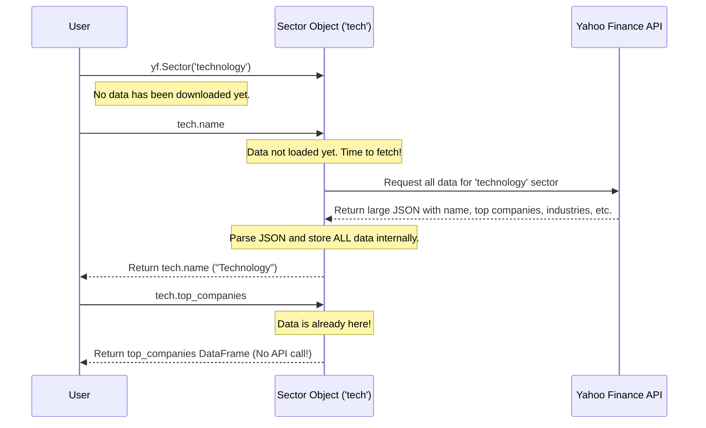

# Chapter 5: Domain Entities (Sector, Industry, Market)

In the last chapter on [WebSocket (Live Data Streaming)](04_websocket__live_data_streaming__.md), we saw how to get real-time price updates. All of our focus so far has been on individual companies, identified by their ticker symbols. But what if you want to zoom out and see the bigger picture?

Instead of looking at a single tree (like a `Ticker` for "MSFT"), what if you want to analyze the entire forest (the Technology sector), a specific type of tree (the Software industry), or even the regional climate (the US market)? This is what "Domain Entities" are for. They let you explore financial data from a top-down perspective.

### The Goal: Understanding a Market Sector

Let's set a goal: **Explore the Technology sector to understand its main sub-industries and identify its top-performing companies.**

This is a common task for investors who want to understand broad market trends before diving into individual stocks.

### Exploring the Forest: The `Sector` Object

The broadest category for classifying companies is the "sector." Think of it as a major division of the economy, like 'Technology', 'Healthcare', or 'Financial Services'. `yfinance` gives us the `Sector` object to explore these.

Let's create an object for the Technology sector. The key for it is simply `'technology'`.

```python
import yfinance as yf

# Create a Sector object for Technology
tech = yf.Sector('technology')
```

Just like the [Ticker Object](01_ticker_object_.md), this line doesn't download any data yet. It's a "lazy" object waiting for your instructions.

Now, let's ask it for some information.

```python
# Get the full name of the sector
print(tech.name)
```
**What you'll see:**
```
Technology
```

That was simple. Now for our main goal: who are the top companies in this sector?

```python
# Get a table of the top companies in the Technology sector
top_companies = tech.top_companies

print(top_companies.head()) # Print the first 5
```
**What you'll see:**

You get a `pandas` DataFrame listing the major players in the technology world, neatly organized.

```
          name rating  market weight
symbol
MSFT   Microsoft  BUY       0.198308
AAPL       Apple  BUY       0.187399
NVDA      NVIDIA  BUY       0.089028
AVGO    Broadcom  BUY       0.038753
META        Meta  BUY       0.033503
```

### Examining the Trees: The `Industry` Object

A sector is made up of more specific "industries." For example, the Technology sector contains industries like "Software," "Semiconductors," and "Consumer Electronics." We can get a list of all industries within our `tech` sector object.

```python
# Get a table of all industries within the Technology sector
industries_in_tech = tech.industries

print(industries_in_tech.head())
```
**What you'll see:**

This gives you another DataFrame, listing all the sub-industries. Notice the `key` column, which we can use to create an `Industry` object.

```
                                               name      symbol  market weight
key
software-infrastructure           Software-Infrastructure  ^YFIN-TECSI       0.285854
semiconductors                           Semiconductors  ^YFIN-TECSC       0.217355
software-application               Software-Application  ^YFIN-TECSA       0.187803
communication-equipment         Communication-Equipment  ^YFIN-TECCE       0.083896
consumer-electronics               Consumer-Electronics  ^YFIN-TECEL       0.076092
```

Let's say we're interested in 'software-infrastructure'. We can create an `Industry` object for it using its key.

```python
# Create an Industry object for Software-Infrastructure
software = yf.Industry('software-infrastructure')

# Let's find its top performing companies
print(software.top_performing_companies.head())
```

**What you'll see:**

This gives you a focused list of the best-performing companies *just within that specific industry*, which is much more targeted than looking at the whole sector.

```
             name  ytd return   last price  target price
symbol
MSFT    Microsoft    0.183063   427.870000        476.02
ORCL       Oracle    0.133758   120.570000        130.33
ADBE        Adobe    0.007621   597.580000        626.33
CRM   Salesforce   -0.036081   275.530000        323.82
INTU       Intuit    0.015255   630.000000        672.64
```

### Checking the Climate: The `Market` Object

Finally, what if you want the highest-level view possible? The `Market` object gives you a snapshot of a regional market's performance, like the major indices in the United States.

```python
# Create a Market object for the United States
us_market = yf.Market('us_market')

# Get a summary of the major indices
print(us_market.summary)
```
**What you'll see:**

You'll get back a dictionary summarizing the current state of major US indices like the S&P 500, Dow Jones, and NASDAQ. It's a quick way to check the overall market "weather."

```
{'^IXIC': {'shortName': 'NASDAQ Composite', 'regularMarketPrice': 15990.66, ...},
 '^GSPC': {'shortName': 'S&P 500', 'regularMarketPrice': 5087.03, ...},
 '^DJI': {'shortName': 'Dow Jones Industrial Average', 'regularMarketPrice': 39069.96, ...}}
```

### What's Happening Under the Hood? Efficient Lazy Loading

You might be wondering if accessing `tech.name` and then `tech.top_companies` makes two separate requests to Yahoo Finance. The answer is **no**, and this is what makes these objects so efficient.

The `Sector` and `Industry` objects use the same "lazy loading" principle as the `Ticker` object, but with a twist. The first time you ask for *any* piece of information (like `.name`), the object makes **one single API call** to get *all* the available data for that sector. It then stores this data internally. Any subsequent requests for other properties (like `.top_companies` or `.industries`) are served instantly from this stored data, requiring no new internet requests.

Here's a diagram showing the process for our `tech` object:



This "fetch-once, use-many-times" strategy is managed by a clever little method inside the base `Domain` class, which `Sector` and `Industry` are built upon. If you look in `yfinance/domain/domain.py`, you'll find the gatekeeper method: `_ensure_fetched`.

```python
# Simplified from yfinance/domain/domain.py

def _ensure_fetched(self, attribute) -> None:
    """
    Ensures that data is fetched if the attribute is not yet loaded.
    """
    if attribute is None:
        self._fetch_and_parse()
```

Every property (like `.name`) calls this method before returning its value. If the internal variable (e.g., `self._name`) is `None`, it means the data hasn't been fetched yet. It then calls `_fetch_and_parse()`, which does the actual work.

The `_fetch_and_parse()` method in the `Sector` class (`yfinance/domain/sector.py`) is where the specific API call happens.

```python
# Simplified from yfinance/domain/sector.py

class Sector(Domain):
    def __init__(self, key, ...):
        # ... setup ...
        self._query_url: str = f'{_QUERY_URL_}/sectors/{self._key}'
        # ...

    def _fetch_and_parse(self) -> None:
        # 1. Make the API call to the specific URL for this sector
        result = self._fetch(self._query_url)
        data = result['data']

        # 2. Parse EVERYTHING and store it
        self._name = data.get('name')
        self._top_companies = self._parse_top_companies(...)
        self._industries = self._parse_industries(...)
        # ... and so on for all properties
```

This design is elegant: the `_ensure_fetched` gatekeeper makes sure the work is only done once, and the `_fetch_and_parse` worker does all the heavy lifting in one efficient trip.

### Conclusion

You've now learned how to move beyond individual stocks to analyze the market from a high-level, top-down perspective.

*   **What you learned:** How to use domain entities to explore broad market categories.
*   **Key Tools:**
    *   `yf.Sector`: For analyzing an entire economic sector (the "forest").
    *   `yf.Industry`: For drilling down into specific industries within a sector (the "trees").
    *   `yf.Market`: For getting a quick snapshot of a regional market's health (the "climate").
*   **The Big Idea:** These objects use efficient, "fetch-once" lazy loading to give you a rich, contextual view of the market without making unnecessary API calls.

All the objects we've met so far—`Ticker`, `Tickers`, `Sector`, `Industry`—are high-level tools that make it easy to ask for data. But they all rely on a common, lower-level component to do the actual job of communicating with Yahoo Finance. What is this component?

In the next chapter, we'll introduce this foundational layer: the [YfData (Data Fetching Layer)](06_yfdata__data_fetching_layer__.md).

---

Generated by Codebase Knowledge Builder