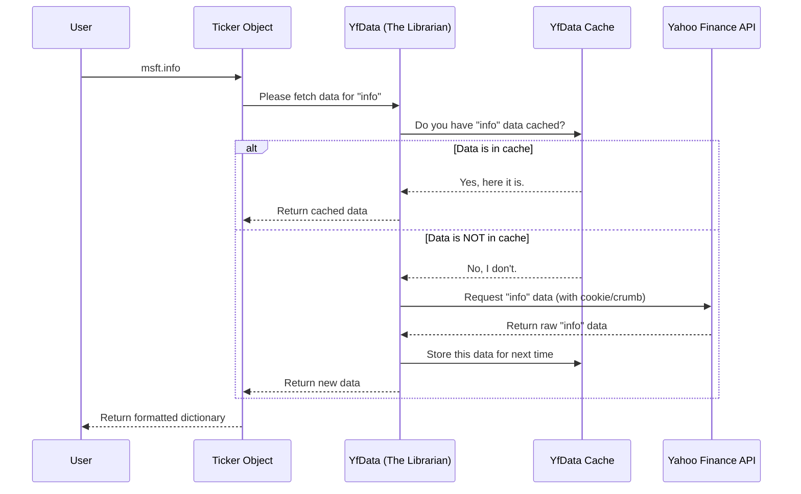

# Chapter 6: YfData (Data Fetching Layer)

In the previous chapter on [Domain Entities (Sector, Industry, Market)](05_domain_entities__sector__industry__market__.md), we explored high-level concepts like sectors and industries. All the objects we've used so far—`Ticker`, `Sector`, `WebSocket`—are designed to make asking for data easy and intuitive. But have you ever wondered what's working behind the scenes to actually fetch that data from the internet?

This chapter pulls back the curtain on the library's engine room: the `YfData` object. You won't ever need to use it directly, but understanding it is key to seeing how `yfinance` works so efficiently.

### The Goal: Centralizing All Data Requests

Imagine a large library where every researcher goes to the shelves themselves to get books. It would be chaos! People might get in each other's way, and if two people need the same book, they'd both have to walk all the way to the shelf.

A better system is to have a single, official librarian. Every researcher gives their request to this librarian, who then fetches the books in an organized way. This is exactly the problem `YfData` solves. It acts as the single, official librarian for the entire `yfinance` project.

Every part of the library, whether it's a `Ticker` object asking for history or a `Sector` object asking for top companies, sends its request to the one and only `YfData` instance.

### Key Roles of the "Librarian" (`YfData`)

Our `YfData` librarian has several crucial responsibilities that make the whole library run smoothly.

#### 1. It's a Singleton: There's Only One Librarian

No matter how many `Ticker` objects you create, they all share the *exact same* `YfData` instance. This is a programming pattern called a "singleton."

```python
import yfinance as yf

# Create two different Ticker objects
msft = yf.Ticker("MSFT")
aapl = yf.Ticker("AAPL")

# Let's peek inside and see their data fetcher
# The 'is' keyword checks if they are the exact same object
print(msft._data is aapl._data)
```

**What you'll see:**
```
True
```
This confirms it! Both `msft` and `aapl` are talking to the same "librarian" (`_data` is the internal name for the `YfData` instance). This prevents conflicts and keeps communication with Yahoo Finance consistent.

#### 2. Session Management: The Master Library Card

The `YfData` object holds the network "session," which is like the master library card for accessing Yahoo Finance. This session keeps track of important details for communicating with the server.

#### 3. Authentication: The Secret Handshake

To get data from Yahoo Finance, you can't just ask. The server requires a "cookie" (a temporary access pass) and a "crumb" (a special security token). `YfData` is solely responsible for getting these credentials and attaching them to every request. It knows the "secret handshake" required to get data, so the `Ticker` objects don't have to.

#### 4. Caching: The Smart Librarian's Desk

`YfData` is smart. If you ask for Microsoft's company info, `YfData` fetches it and keeps a copy on its "desk." If you ask for the same information again a moment later, it doesn't go all the way back to Yahoo's servers. It just gives you the copy it already has. This is called **caching**, and it makes repeated requests for the same data incredibly fast.

### What's Happening Under the Hood?

Let's trace the journey of a simple data request to see how `YfData` does its job.

1.  **The User's Request:** You ask for company information.
    ```python
    info = msft.info
    ```
2.  **Delegation:** The `msft` `Ticker` object doesn't know how to talk to the internet. Instead, it prepares the URL and turns to its internal data fetcher, `self._data` (our `YfData` librarian), and says, "Please get the data from this address."
3.  **The Librarian Takes Over (`YfData`):**
    *   **Check Cache:** `YfData` first checks its cache (its desk). Have I fetched this exact URL recently? If yes, it returns the stored data instantly.
    *   **Get Credentials:** If the data isn't cached, `YfData` makes sure it has a valid cookie and crumb. If not, it gets them from Yahoo Finance.
    *   **Make the Call:** It uses its shared network session to send the request to Yahoo Finance, with the correct credentials attached.
    *   **Store and Return:** When Yahoo's server responds, `YfData` stores the new data in its cache for next time and hands the result back to the `msft` `Ticker` object.
4.  **Final Polish:** The `msft` object takes the raw data from `YfData` and formats it into the nice Python dictionary that you see.

Here is a diagram of this efficient workflow:



This entire process is managed by the `YfData` class located in `yfinance/data.py`. Its singleton behavior is defined using a special "metaclass."

```python
# Simplified from yfinance/data.py

class SingletonMeta(type):
    _instances = {} # A dictionary to hold the single instance
    # ... logic to ensure only one instance is ever created ...

class YfData(metaclass=SingletonMeta):
    """
    Have one place to retrieve data from Yahoo API...
    """
    def __init__(self, session=None, proxy=None):
        self._crumb = None
        self._cookie = None
        # ... and other setup ...
```

When a `Ticker` object is created in `yfinance/base.py`, it gets access to this single instance.

```python
# Simplified from yfinance/base.py

class TickerBase:
    def __init__(self, ticker, session=None):
        # ...
        # This line gets the one and only YfData instance!
        self._data: YfData = YfData(session=session)
        # ...
```

And when `YfData` makes a request, it uses methods like `cache_get` that automatically handle both caching and fetching. The `@lru_cache` is the Python decorator that provides the magic of caching.

```python
# Simplified from yfinance/data.py

class YfData(metaclass=SingletonMeta):
    # ...

    @lru_cache(maxsize=cache_maxsize) # This enables caching!
    def cache_get(self, url, params=None, timeout=30):
        # This method calls another method that handles
        # cookies, crumbs, and the actual network request.
        return self.get(url, params, timeout)
```

By centralizing all this logic, `yfinance` ensures that every part of the library is efficient, consistent, and robust.

### Conclusion

You've now met the unsung hero of the `yfinance` library, the `YfData` object.

*   **What it is:** The central, singleton "librarian" that manages all communication with Yahoo Finance.
*   **Why it's important:** It handles session management, authentication (cookies/crumbs), and caching to make data fetching fast, efficient, and consistent across the entire library.
*   **How it's used:** You don't use it directly. It works silently in the background, serving requests from higher-level objects like `Ticker` and `Sector`.
*   **The Big Idea:** Centralizing the data fetching layer avoids chaos and optimizes performance, just like having a single, skilled librarian is better than a free-for-all.

Now we know that `YfData` is responsible for fetching the raw data from Yahoo. But this raw data is often in a complex format like JSON or HTML. How does `yfinance` turn that raw data into the clean, organized `pandas` DataFrames we love to use? For that, it needs another set of specialized tools.

In the final chapter, we'll meet these tools: the [Data Scrapers](07_data_scrapers_.md).

---

Generated by Codebase Knowledge Builder