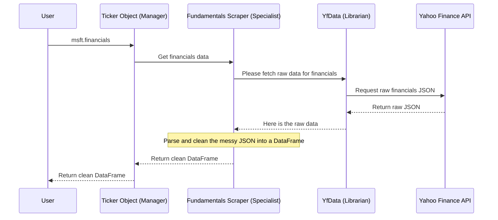

# Chapter 7: Data Scrapers

In the previous chapter on the [YfData (Data Fetching Layer)](06_yfdata__data_fetching_layer__.md), we met the "librarian" of `yfinance`. This `YfData` object is an expert at one thing: fetching raw, unfiltered data from Yahoo Finance's servers. But this raw data is often messy, like a dense, complicated book written in a foreign language.

How does `yfinance` turn that complex raw data into the beautiful, easy-to-use Python dictionaries and `pandas` DataFrames that we've been working with? This is the job of the Data Scrapers.

### The Goal: Turning Raw Data into Clean Information

Imagine you ask your `Ticker` object for Microsoft's financial statements.

```python
import yfinance as yf

msft = yf.Ticker("MSFT")

# How does this...
financials = msft.financials

# ...turn raw web data into a clean table?
print(financials)
```

The raw data from Yahoo Finance for financial statements is a complex JSON structure. The scrapers are the specialists that know exactly how to read this structure, pick out the important pieces, and assemble them into a structured DataFrame.

Think of it like this: `YfData` is the librarian who brings you the ancient, dusty book. The scrapers are a team of expert translators and researchers who read the book for you and give you a neat, one-page summary.

### A Team of Specialists

The main `Ticker` object doesn't do this translation work itself. Instead, it acts like a manager. When you create a `Ticker` object, it assembles a team of specialized scraper objects.

*   `Quote`: An expert on general company info (`.info`).
*   `Fundamentals`: An expert on financial statements (`.financials`, `.balance_sheet`).
*   `Holders`: An expert on who owns the company's stock (`.major_holders`).
*   `Analysis`: An expert on analyst ratings and price targets.
*   And more!

This design keeps the code clean and organized. Each scraper has one job and does it well. When you ask the `Ticker` manager for something, it knows exactly which specialist to delegate the task to.

Let's see this delegation in action. If we ask for `.info`:

```python
# When you ask for this...
info_data = msft.info
```

The `Ticker` object simply turns to its `Quote` scraper expert and says, "get me the info."

If you ask for financial data:

```python
# When you ask for this...
balance_sheet_data = msft.balance_sheet
```

The `Ticker` object turns to its `Fundamentals` scraper expert and asks for the balance sheet. Each request goes to the right specialist for the job.

### What's Happening Under the Hood? The Scraper's Workflow

Let's trace the journey of a request for `.financials` to see how the manager, the specialist, and the librarian all work together.

1.  **The User's Request:** You ask the `Ticker` manager for the financial statements.
    ```python
    financials = msft.financials
    ```
2.  **Delegation:** The `Ticker` object knows this is a job for its `Fundamentals` specialist. It calls the `.financials` property on its internal `_fundamentals` object.
3.  **The Specialist Takes Over (`Fundamentals` scraper):**
    *   The scraper knows the exact URL and format required to get financial data.
    *   It turns to the `YfData` librarian and says, "Please fetch the raw data from this specific URL for financials."
4.  **The Librarian's Job (`YfData`):** The `YfData` object fetches the raw, messy JSON data from Yahoo Finance and hands it back to the `Fundamentals` scraper.
5.  **Parsing and Cleaning:** This is the scraper's most important job. It takes the complex JSON, navigates its structure, extracts the relevant numbers and dates, and carefully arranges them into a clean `pandas` DataFrame.
6.  **Return:** The `Fundamentals` scraper hands the finished, polished DataFrame back to the `Ticker` manager, which then gives it to you.

Here is a diagram showing this clear division of labor:



This elegant design is visible right in the source code. When a `Ticker` object is created in `yfinance/base.py`, it immediately initializes its team of specialists.

```python
# Simplified from yfinance/base.py in the TickerBase __init__ method

class TickerBase:
    def __init__(self, ticker, session=None):
        # ... some setup code ...
        self._data: YfData = YfData(session=session) # Gets the librarian

        # Assembles the team of specialists!
        self._analysis = Analysis(self._data, self.ticker)
        self._holders = Holders(self._data, self.ticker)
        self._quote = Quote(self._data, self.ticker)
        self._fundamentals = Fundamentals(self._data, self.ticker)
        # ... and so on
```
Each scraper is given a reference to the `_data` librarian so it can request data.

Then, when you access a property like `.financials` (which is an alias for `.get_income_stmt`), the `TickerBase` object simply delegates.

```python
# Simplified from yfinance/base.py

    def get_income_stmt(self, ...):
        # It just passes the job to the specialist
        data = self._fundamentals.financials.get_income_time_series(...)
        return data
```

Finally, inside the scraper itself (e.g., `yfinance/scrapers/fundamentals.py`), you find the real work: fetching the raw data via the librarian (`self._data`) and then carefully parsing it into a DataFrame.

```python
# Simplified from yfinance/scrapers/fundamentals.py inside the Financials class

    def _get_financials_time_series(self, timescale, keys: list) -> pd.DataFrame:
        # 1. It constructs the specific URL needed for this data type
        url = f"https://.../timeseries/{self._symbol}?type={...}"

        # 2. It asks the librarian to fetch the raw data
        json_str = self._data.cache_get(url=url).text
        json_data = json.loads(json_str)
        data_raw = json_data["timeseries"]["result"]

        # 3. It does the hard work of parsing the JSON into a DataFrame
        # ... (complex parsing logic here) ...
        df = pd.DataFrame(...)

        return df
```
This separation of concerns—manager, specialist, librarian—is what makes the `yfinance` library so powerful yet maintainable.

### Conclusion: The Full Picture

Congratulations! You have completed the tour of `yfinance`'s architecture. You now understand the entire process, from your simple request to the final, clean data you receive.

*   **What you learned:** Data Scrapers are specialized classes that translate raw, messy web data into clean, usable Python objects.
*   **Key Idea:** The `Ticker` object acts as a manager, delegating tasks to a team of scraper specialists (`Quote`, `Fundamentals`, etc.), who in turn use the `YfData` "librarian" to fetch raw data before parsing it.
*   **The Full Journey:**
    1.  You start with a high-level object like the [Ticker Object](01_ticker_object_.md).
    2.  This `Ticker` object delegates your request to a specialized **Data Scraper** (this chapter!).
    3.  The scraper asks the central [YfData (Data Fetching Layer)](06_yfdata__data_fetching_layer_.md) to fetch the raw data.
    4.  `YfData` communicates with Yahoo Finance's servers.
    5.  The scraper receives the raw data and parses it into a clean format.
    6.  The final, clean data is returned to you.

You've moved from being a user to being an informed developer who understands the "why" and "how" behind the library. With this knowledge, you are now fully equipped to explore, analyze, and innovate with financial data. Happy coding

---

Generated by Codebase Knowledge Builder