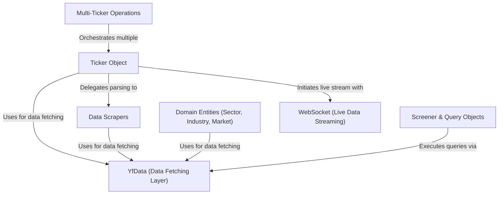

# Tutorial: yfinance

`yfinance` is a popular Python library that makes it incredibly *easy* to download historical and real-time financial market data from Yahoo Finance. The core of the library is the **`Ticker` object**, which acts as a gateway to all information for a specific stock, like `MSFT`. You can use it to fetch everything from historical prices to financial statements, or even download data for **multiple tickers at once**.

**Source Repository:** [https://github.com/ranaroussi/yfinance](https://github.com/ranaroussi/yfinance)

## Chapters

1. [Ticker Object
](01_ticker_object_.md)
2. [Multi-Ticker Operations
](02_multi_ticker_operations_.md)
3. [Screener & Query Objects
](03_screener___query_objects_.md)
4. [WebSocket (Live Data Streaming)
](04_websocket__live_data_streaming__.md)
5. [Domain Entities (Sector, Industry, Market)
](05_domain_entities__sector__industry__market__.md)
6. [YfData (Data Fetching Layer)
](06_yfdata__data_fetching_layer__.md)
7. [Data Scrapers
](07_data_scrapers_.md)

---

Generated by Codebase Knowledge Builder